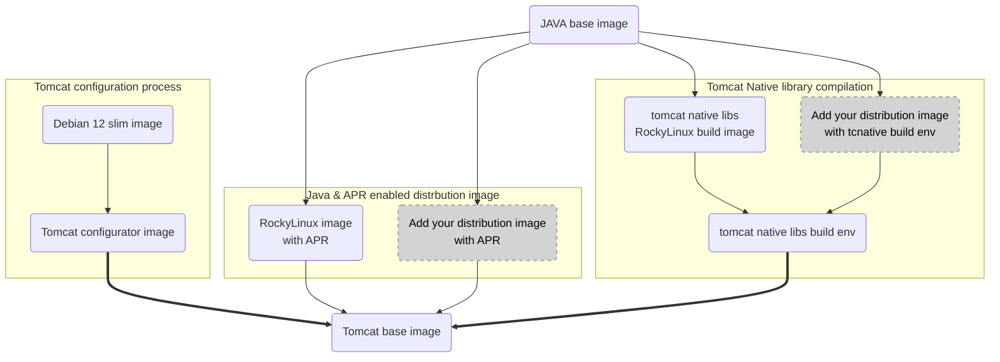

# Alfresco Docker Base Tomcat [](https://github.com/Alfresco/alfresco-docker-base-tomcat/actions/workflows/main.yml) 

This repository provides the base Docker images for Tomcat that are meant to be
used within the Alfresco engineering to build Docker images for Java/Tomcat
applications.

This image relies on the [alfresco-docker-base-java](https://github.com/Alfresco/alfresco-docker-base-java) image.

## Flavours

Choose between one of the available flavours built from this repository:

Tomcat version | Java version | OS            | Image ref                                                  | Size
---------------|--------------|---------------|------------------------------------------------------------|--------------------------------------
9              | 11           | Rocky Linux 8 | `alfresco/alfresco-base-tomcat:tomcat9-jre11-rockylinux8`  | ![tomcat9-jre11-rockylinux8 size][1]
9              | 17           | Rocky Linux 8 | `alfresco/alfresco-base-tomcat:tomcat9-jre17-rockylinux8`  | ![tomcat9-jre17-rockylinux8 size][2]
10             | 11           | Rocky Linux 8 | `alfresco/alfresco-base-tomcat:tomcat9-jre11-rockylinux8`  | ![tomcat10-jre11-rockylinux8 size][3]
10             | 17           | Rocky Linux 8 | `alfresco/alfresco-base-tomcat:tomcat10-jre17-rockylinux8` | ![tomcat10-jre17-rockylinux8 size][4]
10             | 17           | Rocky Linux 9 | `alfresco/alfresco-base-tomcat:tomcat10-jre17-rockylinux9` | ![tomcat10-jre17-rockylinux9 size][5]
10             | 21           | Rocky Linux 9 | `alfresco/alfresco-base-tomcat:tomcat10-jre21-rockylinux9` | ![tomcat10-jre21-rockylinux9 size][6]
10             | 25           | Rocky Linux 9 | `alfresco/alfresco-base-tomcat:tomcat10-jre25-rockylinux9` | ![tomcat10-jre25-rockylinux9 size][9]
11             | 21           | Rocky Linux 9 | `alfresco/alfresco-base-tomcat:tomcat11-jre21-rockylinux9` | ![tomcat11-jre21-rockylinux9 size][7]
11             | 25           | Rocky Linux 9 | `alfresco/alfresco-base-tomcat:tomcat11-jre25-rockylinux9` | ![tomcat11-jre25-rockylinux9 size][8]

[1]: https://img.shields.io/docker/image-size/alfresco/alfresco-base-tomcat/tomcat9-jre11-rockylinux8
[2]: https://img.shields.io/docker/image-size/alfresco/alfresco-base-tomcat/tomcat9-jre17-rockylinux8
[3]: https://img.shields.io/docker/image-size/alfresco/alfresco-base-tomcat/tomcat10-jre11-rockylinux8
[4]: https://img.shields.io/docker/image-size/alfresco/alfresco-base-tomcat/tomcat10-jre17-rockylinux8
[5]: https://img.shields.io/docker/image-size/alfresco/alfresco-base-tomcat/tomcat10-jre17-rockylinux9
[6]: https://img.shields.io/docker/image-size/alfresco/alfresco-base-tomcat/tomcat10-jre21-rockylinux9
[7]: https://img.shields.io/docker/image-size/alfresco/alfresco-base-tomcat/tomcat11-jre21-rockylinux9
[8]: https://img.shields.io/docker/image-size/alfresco/alfresco-base-tomcat/tomcat11-jre25-rockylinux9
[9]: https://img.shields.io/docker/image-size/alfresco/alfresco-base-tomcat/tomcat10-jre25-rockylinux9

The images are available on:

* [Docker Hub](https://hub.docker.com/r/alfresco/alfresco-base-tomcat), image name: `alfresco/alfresco-base-tomcat`
* [Quay](https://quay.io/repository/alfresco/alfresco-base-tomcat) (enterprise credentials required), image name: `quay.io/alfresco/alfresco-base-tomcat`

### Image pinning

The pinning approach provided in
[alfresco-base-java](https://github.com/Alfresco/alfresco-docker-base-java/blob/master/README.md#image-pinning)
is highly suggested for this image too.

## Image customization

This image's Dockerfile is extensively using multi-stage builds to allow for
customization of the image. The build process can be represented as shown in the
diagram below:



### Customizing the Tomcat configuration

To customize the Tomcat configuration, you can directly modify the `tomcat_dist`
image build. This step leverage a debian image to download, check & configure
the Tomcat distribution. By default the tool
[xmlstarlet](https://xmlstar.sourceforge.net/doc/UG/index.html) is used to
modify xml files (e.g. `conf/server.xml`) file so you can reuse it to apply
your own changes. Should you need more tools, you can add them in the using
the `apt-get install` command. As this is a multi-stage build, the tools
installed in the `tomcat_dist` image are not present in the final image.

> We recommend that configuration applied in this image is generic and not
> related to a single web application. A configuration change related to a
> specific web application should be done in the web application image.

### Using a different base distribution/image

This project lets you use a different base distribution/image to create your
Alfresco Tomcat base image.
To do that you need to create additional, distro specific, stages in the
multi-stage build and name them according to the build arguments you want to
use at [build time](#how-to-build-an-image-locally).

#### Base image requirements

The base image you want to use to build the Alfresco Tomcat base image must
match the following requirements:

* Provide a compatible and up-to-date Java Runtime Environment (JRE) version
  (for production we using JRE over JDK) as per the [Alfresco compatibility
  matrix][acs-support]

#### Specifying the new base image

In addition to the build arguments documented in the [build
time](#how-to-build-an-image-locally), you need to tell the build process where
the java base image can be found (if it's not present on the Alfresco image
registry). The following build arguments are available:

* IMAGE_JAVA_REPO: the repository where the base image can be found (default is
  quay.io/alfresco)
* IMAGE_JAVA_NAME: the name of the base image to use (default is
  alfresco-base-java)
* IMAGE_JAVA_TAG: the tag of the base image to use (default is
  jre${JAVA_MAJOR}-${DISTRIB_NAME}${DISTRIB_MAJOR})

#### Implementing Tomcat native libs build stage

You'll need to create a new stage in the Dockerfile that will be used to build
the Tomcat native libraries. This stage should be named
`tcnative_build-<DISTRIB_NAME>` where `<DISTRIB_NAME>` is the name of the
distribution you want to use. Take a look at the existing
`tcnative_build-rockylinux` stage for an example, but overall the goal is to
install on your target distribution the required packages to build the Tomcat
native libraries in the `/usr/local/tcnative` directory, so it can be copied
to the final image.

For example:

```Dockerfilea
FROM debian:bullseye-slim AS tcnative_build-ubuntu
...
```

#### Implementing APR enabled Tomcat base stage

This stage is pretty simple, you just need to install the APR package on your
distribution. This stage should be named `apr_pkg-<DISTRIB_NAME>` where
`<DISTRIB_NAME>` is the name of the distribution you want to use.

## Development

### Naming specs

The images built from this repository are named as follow:

`tomcat<TOMCAT_VERSION>-<JAVA_DISTRIBUTION_TYPE><JAVA_MAJOR_VERSION>-<OS_DISTRIBUTION_NAME><OS_DISTRIBUTION_VERSION>`

### How to build an image locally

To build this image, run the following script with the needed variables set properly:

```bash
docker buildx build -t $IMAGE_REPOSITORY . \
  --build-arg DISTRIB_NAME=$DISTRIB_NAME \
  --build-arg DISTRIB_MAJOR=$DISTRIB_MAJOR \
  --build-arg JAVA_MAJOR=$JAVA_MAJOR \
  --build-arg TOMCAT_MAJOR=$TOMCAT_MAJOR \
  --build-arg TOMCAT_VERSION=$TOMCAT_VERSION \
  --build-arg TCNATIVE_VERSION=$TCNATIVE_VERSION \
  --build-arg APR_VERSION=$APR_VERSION \
  --build-arg TOMCAT_SHA512=$TOMCAT_SHA512 \
  --build-arg TCNATIVE_SHA512=$TCNATIVE_SHA512 \
  --build-arg APR_SHA256=$APR_SHA256 \
  --no-cache
```

where:

* DISTRIB_NAME is rockylinux
* DISTRIB_MAJOR is 8 or 9 for rockylinux
* JAVA_MAJOR is 11, 17 or 21 for rockylinux only
* TOMCAT_MAJOR is 9, 10 or 11

### Release

New images are built automatically on each new commit on master and on a weekly schedule.

## Downstream projects

* [alfresco-community-repo](https://github.com/Alfresco/alfresco-community-repo/blob/master/packaging/docker-alfresco/Dockerfile)
* [alfresco-community-share](https://github.com/Alfresco/alfresco-community-share/blob/master/packaging/docker/Dockerfile)

[acs-support]: https://support.hyland.com/r/Alfresco/Alfresco-Content-Services/23.4/Alfresco-Content-Services/Supported-Platforms
